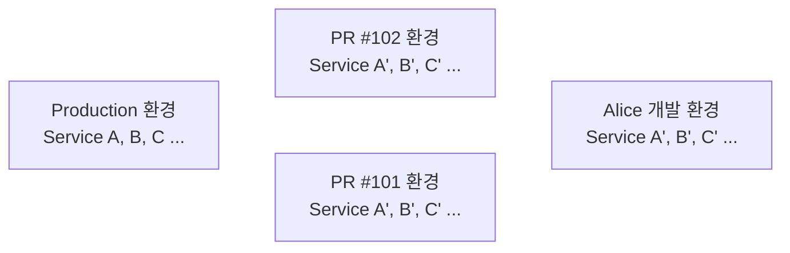
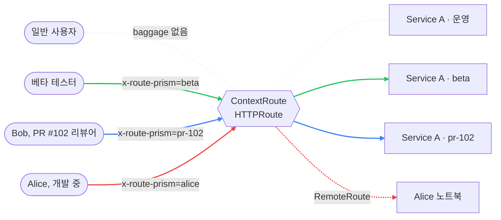
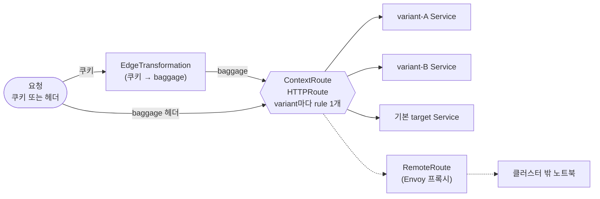

<div align="center">


# route-prism

**컨텍스트 인지형 [GAMMA](https://gateway-api.sigs.k8s.io/mesh/gamma/) 라우팅 컨트롤러**

**쿠키 또는 헤더 한 줄로 어떤 Service 변종(variant)으로 갈지 결정합니다.**

[English](README.md) | [한국어](README.ko.md) | [Wiki](https://github.com/egoavara/route-prism/wiki)

[](LICENSE)
[](https://github.com/egoavara/route-prism/releases)
[](go.mod)
[](https://gateway-api.sigs.k8s.io/mesh/gamma/)

[](https://github.com/egoavara/route-prism/pkgs/container/route-prism)
[](https://github.com/egoavara/route-prism/pkgs/container/charts%2Froute-prism)[](https://github.com/egoavara/route-prism/actions/workflows/release.yml)

</div>

---

## 왜 필요한가요

PR마다 프리뷰 환경을 통째로 띄우는 비용을 제거합니다. 클러스터는 하나, variant Service만 추가합니다.

### Before — PR/개발자마다 환경 복제



의존 서비스·DB·인프라가 N벌. 비용·운영·동기화 폭발.

### After — 클러스터 하나, variant만 갈아끼움



쿠키/헤더 한 줄로 variant가 정해집니다. 일반 사용자 트래픽은 영향 없음.

### 이런 게 필요했다면

- **MSA 프리뷰 환경 비용** — PR 하나에 namespace 하나 띄우는 대신, 변경된 Service만 variant로 추가합니다.
- **베타 기능 노출** — 특정 사용자 그룹에만 새 기능을 보여주고 싶을 때, 쿠키 한 줄로 분기합니다.
- **PR 중 개발자끼리 확인** — Alice의 변경분을 Bob이 직접 호출해보고 싶을 때, baggage 한 줄로 Alice의 variant(또는 노트북)에 도달합니다.

## 클러스터의 GAMMA 지원 여부 확인

설치 전 메시가 GAMMA를 제대로 처리하는지 한 번에 확인합니다.

```bash
curl -sSL https://raw.githubusercontent.com/egoavara/route-prism/main/scripts/verify.sh | bash
```

`curl | bash` 가 차단되는 환경(샌드박스·보안 정책)이라면 저장소를 clone 한 뒤 `./scripts/verify.sh` 를 직접 실행해도 동일하게 동작합니다.

실패하면 원인(CRD 누락 / GAMMA 미지원 / 컨트롤러 거부)과 Istio·Cilium 버전별 조치를 함께 안내합니다.

## 설치

**요구사항:** Kubernetes ≥ 1.28, [GAMMA 지원](https://gateway-api.sigs.k8s.io/implementations/) 메시.

```bash
# Helm (권장)
helm install route-prism oci://ghcr.io/egoavara/charts/route-prism \
  --version <latest> -n route-prism --create-namespace

# 단일 YAML
kubectl apply -f https://github.com/egoavara/route-prism/releases/latest/download/route-prism.yaml
```

바이너리는 [Releases](https://github.com/egoavara/route-prism/releases/latest)에서 받습니다.

## 빠른 시작

### 1. Service를 variant로 분기

```yaml
apiVersion: route-prism.egoavara.net/v1alpha1
kind: ContextRoute
metadata:
  name: checkout
  namespace: shop
spec:
  target:
    service:
      name: checkout
  variants:
    selector:
      matchLabels:
        route-prism.egoavara.net/variant-of: checkout
```

`route-prism.egoavara.net/variant-of: checkout` 라벨이 붙은 Service가 라우팅 대상이 됩니다. `baggage: x-route-prism=<service-name>` 요청이 그쪽으로 갑니다.

### 2. 브라우저 쿠키 → Baggage

```yaml
apiVersion: route-prism.egoavara.net/v1alpha1
kind: EdgeTransformation
metadata:
  name: checkout-edge
  namespace: shop
spec:
  mode: router
  sourceCookie: x-route-prism
  target:
    service:
      name: checkout
  widgetInjection:
    enable: true
```

쿠키를 Baggage로 변환합니다. 위젯을 켜면 페이지에 variant 셀렉터가 뜹니다.

### 3. 노트북으로 트래픽 터널링

```yaml
apiVersion: route-prism.egoavara.net/v1alpha1
kind: RemoteRoute
metadata:
  name: alice
  namespace: shop
spec:
  contextRouteRef:
    name: checkout
  upstreams:
    - url: https://alice-laptop.tailnet.ts.net:8443
```

`baggage: x-route-prism=alice`가 붙은 요청만 alice의 노트북으로 갑니다.

## 무엇을 하나요

CRD 3종으로 트래픽 분기·원격 라우팅·섀도우 트래픽을 다룹니다.

- **`ContextRoute`** — [W3C Baggage](https://www.w3.org/TR/baggage/) 값으로 Service variant 분기. CR 1개 = HTTPRoute 1개.
- **`EdgeTransformation`** — 쿠키를 엣지에서 Baggage로 변환. 옵션으로 인페이지 위젯 주입.
- **`RemoteRoute`** — variant 트래픽을 클러스터 밖 노트북으로 보내는 Envoy 프록시 자동 생성.

표준 [Gateway API GAMMA](https://gateway-api.sigs.k8s.io/mesh/gamma/) 위에서 `HTTPRoute`만 만듭니다 — 메시를 대체하지 않습니다.

## 동작 원리



상세 설계는 [Wiki](https://github.com/egoavara/route-prism/wiki)에.

## 문서

- **[Wiki](https://github.com/egoavara/route-prism/wiki)** — CRD 상세, 전파 규칙, 호환성, 운영 가이드.
- **예제** — `config/samples/`.

## 기여

이슈·PR 환영. 개발 워크플로우는 [`AGENTS.md`](AGENTS.md).

## 라이선스

[MIT License](LICENSE) © 2026 [egoavara](https://github.com/egoavara)
