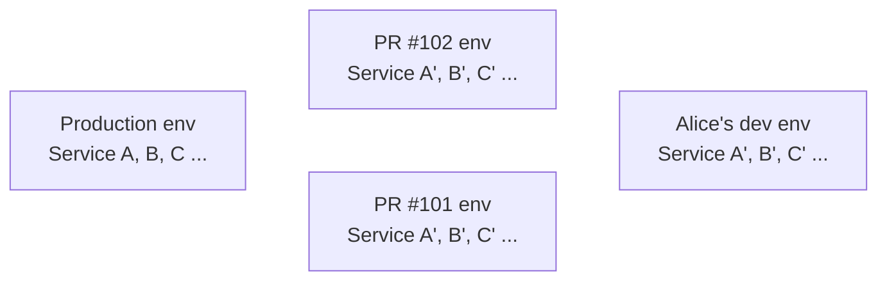
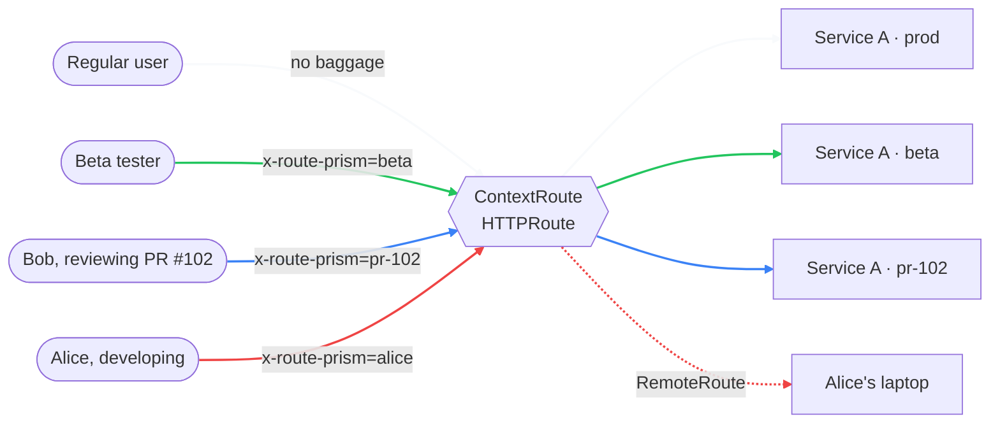
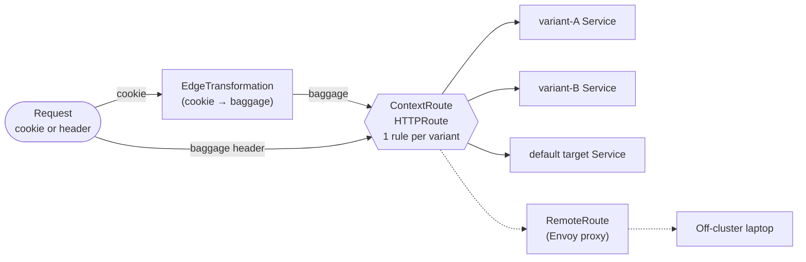

<div align="center">


# route-prism

**Context-aware [GAMMA](https://gateway-api.sigs.k8s.io/mesh/gamma/) routing for Kubernetes**

**One cookie or header decides which variant of a Service the request lands on.**

[English](README.md) | [한국어](README.ko.md) | [Wiki](https://github.com/egoavara/route-prism/wiki)

[](LICENSE)
[](https://github.com/egoavara/route-prism/releases)
[](go.mod)
[](https://gateway-api.sigs.k8s.io/mesh/gamma/)

[](https://github.com/egoavara/route-prism/pkgs/container/route-prism)
[](https://github.com/egoavara/route-prism/pkgs/container/charts%2Froute-prism)[](https://github.com/egoavara/route-prism/actions/workflows/release.yml)

</div>

---

## Why you need this

Stops you from spinning up a whole preview environment per PR. One cluster, just add variant Services.

### Before — environment copy per PR / developer



Dependent services, DBs, infra duplicated N times. Cost, ops, and drift explode.

### After — one cluster, swap only the variant



One cookie or header decides the variant. Regular user traffic is untouched.

### Use it when

- **MSA preview env costs hurt** — instead of a namespace per PR, only add variants for the changed Services.
- **Beta features for a specific group** — flip a cookie, route just that group to the new variant.
- **Dev-to-dev PR review** — Bob hits Alice's variant (or her laptop) directly with one baggage value.

## Verify GAMMA support

Check that your mesh actually honours GAMMA before installing.

```bash
curl -sSL https://raw.githubusercontent.com/egoavara/route-prism/main/scripts/verify.sh | bash
```

If your environment blocks `curl | bash` (sandboxes, security policies), clone the repo and run `./scripts/verify.sh` directly — it is identical.

On failure it pinpoints the cause (missing CRD / no GAMMA controller / controller rejection) with version-specific advice for Istio and Cilium.

## Install

**Requirements:** Kubernetes ≥ 1.28, a [GAMMA-supporting](https://gateway-api.sigs.k8s.io/implementations/) mesh.

```bash
# Helm (recommended)
helm install route-prism oci://ghcr.io/egoavara/charts/route-prism \
  --version <latest> -n route-prism --create-namespace

# Single-file YAML
kubectl apply -f https://github.com/egoavara/route-prism/releases/latest/download/route-prism.yaml
```

Binaries on the [Releases page](https://github.com/egoavara/route-prism/releases/latest).

## Quickstart

### 1. Split a Service into variants

```yaml
apiVersion: route-prism.egoavara.net/v1alpha1
kind: ContextRoute
metadata:
  name: checkout
  namespace: shop
spec:
  target:
    service:
      name: checkout
  variants:
    selector:
      matchLabels:
        route-prism.egoavara.net/variant-of: checkout
```

Any Service labeled `route-prism.egoavara.net/variant-of: checkout` becomes a routing target. Send `baggage: x-route-prism=<service-name>` to land there.

### 2. Browser cookie → Baggage

```yaml
apiVersion: route-prism.egoavara.net/v1alpha1
kind: EdgeTransformation
metadata:
  name: checkout-edge
  namespace: shop
spec:
  mode: router
  sourceCookie: x-route-prism
  target:
    service:
      name: checkout
  widgetInjection:
    enable: true
```

Rewrites the cookie into Baggage. The optional widget gives users an in-page variant selector.

### 3. Tunnel traffic to a laptop

```yaml
apiVersion: route-prism.egoavara.net/v1alpha1
kind: RemoteRoute
metadata:
  name: alice
  namespace: shop
spec:
  contextRouteRef:
    name: checkout
  upstreams:
    - url: https://alice-laptop.tailnet.ts.net:8443
```

Only requests with `baggage: x-route-prism=alice` reach Alice's machine.

## What it does

Three CRDs covering traffic split, remote routing, and shadow traffic.

- **`ContextRoute`** — splits traffic by [W3C Baggage](https://www.w3.org/TR/baggage/) member. One CR = one HTTPRoute.
- **`EdgeTransformation`** — rewrites cookies to Baggage at the edge. Optional in-page widget.
- **`RemoteRoute`** — provisions an Envoy proxy that forwards variant traffic out to a developer's laptop.

Built on standard [Gateway API GAMMA](https://gateway-api.sigs.k8s.io/mesh/gamma/) — emits `HTTPRoute`, doesn't replace your mesh.

## How it works



Full design in the [Wiki](https://github.com/egoavara/route-prism/wiki).

## Documentation

- **[Wiki](https://github.com/egoavara/route-prism/wiki)** — CRD details, propagation rules, mesh compatibility, runbooks.
- **Examples** — `config/samples/`.

## Contributing

Issues and PRs welcome. Dev workflow in [`AGENTS.md`](AGENTS.md).

## License

[MIT License](LICENSE) © 2026 [egoavara](https://github.com/egoavara)
